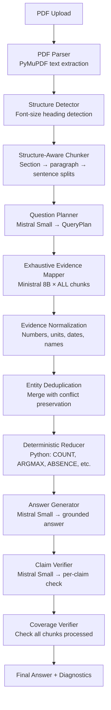

# FULLSCAN-QA

**Operator-Aware Exhaustive Large-Document Question Answering without RAG**

> This system does not use embeddings, vector search, semantic retrieval, reranking, or top-k context selection. Every document chunk is processed for every applicable question batch.

## 1. Purpose

FULLSCAN-QA answers complex questions about large PDF documents that may not fit reliably into a single LLM context. It handles:

- **Aggregation**: "How many entities satisfy condition X?"
- **Superlatives**: "Which entity has the largest value?"
- **Absence**: "Which topic is never discussed?"
- **List completeness**: "List every entity satisfying a condition."
- **Numeric operations**: Count, sum, average, difference, percent change
- **Comparison**: Compare distant entities
- **Temporal reasoning**: Latest rule, event ordering
- **Multi-hop**: Combine evidence from multiple sections

## 2. Why Not RAG?

Retrieval-Augmented Generation (RAG) retrieves only the top-k most similar chunks for a query. This fails catastrophically when:

- **Aggregation** requires scanning every entity across the entire document
- **Superlatives** need comparison of all candidates, not just the most "relevant" ones
- **Absence** can only be proven by confirming all chunks lack the topic — not by retrieving a few
- **Count completeness** requires finding *every* matching entity, not just those with high similarity scores

FULLSCAN-QA solves this by processing **every chunk** for every question.

## 3. Architecture



## 4. Pipeline Stages

| Stage | Model | Purpose |
|-------|-------|---------|
| **Planner** | Mistral Small 3.2 | Transform question → structured QueryPlan |
| **Mapper** | Ministral 3 8B | Extract evidence from each chunk |
| **Reducer** | Python (no LLM) | Deterministic COUNT, ARGMAX, ABSENCE, etc. |
| **Answer** | Mistral Small 3.2 | Generate grounded natural-language answer |
| **Verifier** | Mistral Small 3.2 | Verify each claim against evidence |

## 5. Model Restrictions

Only these model families are permitted:
- **Mistral Small 3.2** (default ID: `mistral-small-2506`)
- **Ministral 3 8B** (default ID: `ministral-8b-2512`)

No other LLMs (Gemini, OpenAI, Claude, Cohere, Llama, embedding models, OCR models) may be used.

## 6. Installation

```bash
cd fullscan-qa
pip install -e ".[dev]"
```

## 7. Environment Configuration

```bash
cp .env.example .env
# Edit .env with your API key and model settings
```

### Key Variables

| Variable | Default | Description |
|----------|---------|-------------|
| `LLM_PROVIDER` | `mistral_api` | `mistral_api` or `openai_compatible` |
| `MISTRAL_API_KEY` | (empty) | Your Mistral API key |
| `LLM_BASE_URL` | (empty) | Base URL for OpenAI-compatible endpoint |
| `PLANNER_MODEL` | `mistral-small-2506` | Model for question planning |
| `MAPPER_MODEL` | `ministral-8b-2512` | Model for evidence extraction |
| `VERIFIER_MODEL` | `mistral-small-2506` | Model for claim verification |
| `ANSWER_MODEL` | `mistral-small-2506` | Model for answer generation |
| `MAX_CONCURRENT_REQUESTS` | `4` | Concurrent mapper requests |
| `CHUNK_TARGET_TOKENS` | `3500` | Target chunk size (approx tokens) |
| `QUESTION_BATCH_SIZE` | `4` | Questions per mapper call |
| `PIPELINE_MODE` | `FULLSCAN_OPERATOR` | Pipeline mode |

### Changing Model IDs

The exact model IDs may differ depending on your endpoint. Update them in `.env`:

```bash
# For a university endpoint with different naming:
PLANNER_MODEL=mistral-small-latest
MAPPER_MODEL=ministral-8b-latest
```

## 8. Mistral API Mode

```bash
LLM_PROVIDER=mistral_api
MISTRAL_API_KEY=your-api-key-here
```

## 9. OpenAI-Compatible Endpoint Mode

For university-hosted or local endpoints serving approved Mistral models:

```bash
LLM_PROVIDER=openai_compatible
LLM_BASE_URL=http://your-endpoint:8000/v1
MISTRAL_API_KEY=your-token-if-needed
```

## 10. Running FastAPI

```bash
uvicorn app.api.main:app --host 0.0.0.0 --port 8000 --reload
```

API endpoints:
- `GET /health` — Health check
- `POST /documents` — Upload and parse PDF
- `GET /documents/{document_id}` — Document metadata
- `POST /answer` — Answer questions
- `POST /answer-direct` — Upload PDF + answer in one request
- `GET /runs/{run_id}` — Retrieve run results

## 11. Running Streamlit

```bash
streamlit run ui/streamlit_app.py
```

## 12. CLI Examples

```bash
# Inspect a document
python scripts/inspect_document.py document.pdf --sections --chunks --quality

# Run the pipeline
python scripts/run_pipeline.py document.pdf \
  -q "How many parks have elevation over 3000m?" \
     "Which park has the largest area?" \
  -o results.json

# Run evaluation
python scripts/run_evaluation.py document.pdf eval_questions.jsonl \
  -m FULLSCAN_OPERATOR -o eval_results/
```

## 13. Running Tests

```bash
# All offline tests
pytest tests/ -v

# Specific test files
pytest tests/test_reducer.py -v
pytest tests/test_normalizer.py -v
pytest tests/test_pipeline_fake_llm.py -v

# With coverage
pytest tests/ -v --cov=app --cov-report=term-missing
```

## 14. Running Evaluation

Input JSONL format:
```json
{"question_id": "q1", "question": "...", "reference_answer": "...", "required_key_points": ["..."], "question_type": "ARGMAX"}
```

```bash
python scripts/run_evaluation.py document.pdf eval.jsonl -m FULLSCAN_OPERATOR
```

## 15. Output Artifacts

All outputs are stored under `data/`:
- `data/uploads/` — Original PDFs
- `data/parsed/` — Parsed pages and chunks as JSON
- `data/runs/` — Complete pipeline run results
- `data/cache/` — Mapper response cache

## 16. Known Limitations

- Token counting uses `len(text) / 4` approximation (exact Mistral tokenizer not in deps)
- Vision fallback for image-heavy pages requires endpoint support
- No database — filesystem-only persistence
- Concurrent mapping is bounded by `MAX_CONCURRENT_REQUESTS`
- Large documents may require extended processing time

## 17. Competition-Day Checklist

1. ✅ Set correct model IDs in `.env` for the competition endpoint
2. ✅ Test with `GET /health` to verify API is running
3. ✅ Upload the competition PDF via `POST /documents`
4. ✅ Run questions via `POST /answer` with `FULLSCAN_OPERATOR` mode
5. ✅ Check coverage percentages in the response
6. ✅ If coverage is low, increase `MAX_RETRIES` and re-run
7. ✅ Download diagnostics for submission

## 18. Adapting the Companion-App Endpoint

Use `POST /answer-direct` for single-request upload + answer:

```bash
curl -X POST http://localhost:8000/answer-direct \
  -F "file=@document.pdf" \
  -F 'questions_json=[{"question_id":"q1","question":"..."}]'
```

## 19. Token & Performance Optimization

- **Question batching**: Multiple questions per mapper call (default 4)
- **Response caching**: Content-hash-based cache keys prevent re-processing
- **Configurable concurrency**: Tune `MAX_CONCURRENT_REQUESTS` for your endpoint
- **Chunk size**: Adjust `CHUNK_TARGET_TOKENS` based on model context window
- **Baseline comparison**: Run `DIRECT_CONTEXT` or `SUMMARY_MAP_REDUCE` modes to compare

## 20. Baseline Modes

| Mode | Description | Use Case |
|------|-------------|----------|
| `FULLSCAN_OPERATOR` | Full pipeline with operators | Production |
| `DIRECT_CONTEXT` | Stuff document into context | Comparison baseline |
| `SUMMARY_MAP_REDUCE` | Chunk summaries → synthesis | Comparison baseline |
| `REFINE` | Sequential draft refinement | Comparison baseline |
